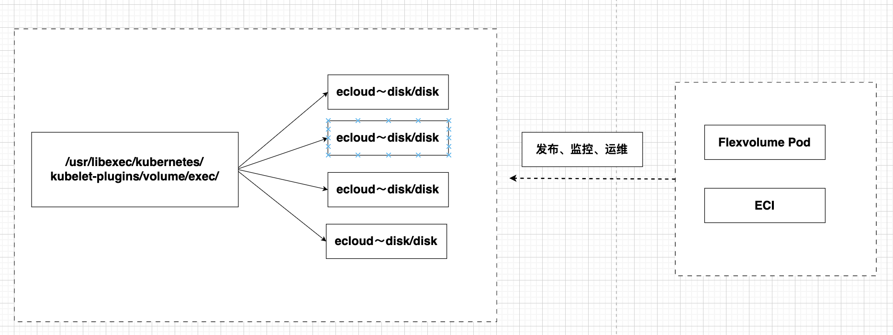

# 移动云容器服务 K8S Flexvolume 插件

针对移动云云盘、NAS、OSS、PFS存储开发的flexvolume插件，可以支持kubernetes pod、容器实例ECI 自动绑定移动云存储服务。

此版本支持Flexvolume, 静态pv. 对于动态pv尚不支持.

## 部署框架
  

## 安装使用该插件：


通过下面yaml配置进行部署移动云K8S存储插件，目前支持CentOS、BC-Linux、BC-Euler 操作系统；

**注意：**
> 1. 使用oss数据卷服务时必须配置Secret，如果只使用nas、云盘，则可以不配置Secret；
> 2. 使用flexvolume需要kubelet关闭`--enable-controller-attach-detach`选项。默认移动云K8S集群已经关闭此选项；
> 3. 在kube-system用户空间部署flexvolume；


```
apiVersion: apps/v1 # for versions before 1.8.0 use extensions/v1beta1
kind: DaemonSet
metadata:
  name: flexvolume
  namespace: kube-system
  labels:
    k8s-volume: flexvolume
spec:
  selector:
    matchLabels:
      name: acs-flexvolume
  template:
    metadata:
      labels:
        name: acs-flexvolume
    spec:
      hostPID: true
      hostNetwork: true
      tolerations:
      - key: node-role.kubernetes.io/master
        operator: Exists
        effect: NoSchedule
      containers:
      - name: acs-flexvolume
        image: flexvolume:***
        imagePullPolicy: Always
        securityContext:
          privileged: true
        env:
        - name: ACS_DISK
          value: "true"
        - name: ACS_NAS
          value: "true"
        - name: ACS_OSS
          value: "true"
        - name: ACCESS_KEY_ID
          value: ""
        - name: ACCESS_KEY_SECRET
          value: ""
        - name: SLB_ENDPOINT
          value: ""
        - name: ECS_ENDPOINT
          value: ""
        resources:
          limits:
            memory: 200Mi
          requests:
            cpu: 100m
            memory: 200Mi
        volumeMounts:
        - name: usrdir
          mountPath: /host/usr/
        - name: etcdir
          mountPath: /host/etc/
        - name: logdir
          mountPath: /var/log/ecloud/
      volumes:
      - name: usrdir
        hostPath:
          path: /usr/
      - name: etcdir
        hostPath:
          path: /etc/
      - name: logdir
        hostPath:
          path: /var/log/ecloud/
  updateStrategy:
    type: RollingUpdate
```


## ROADMAP

